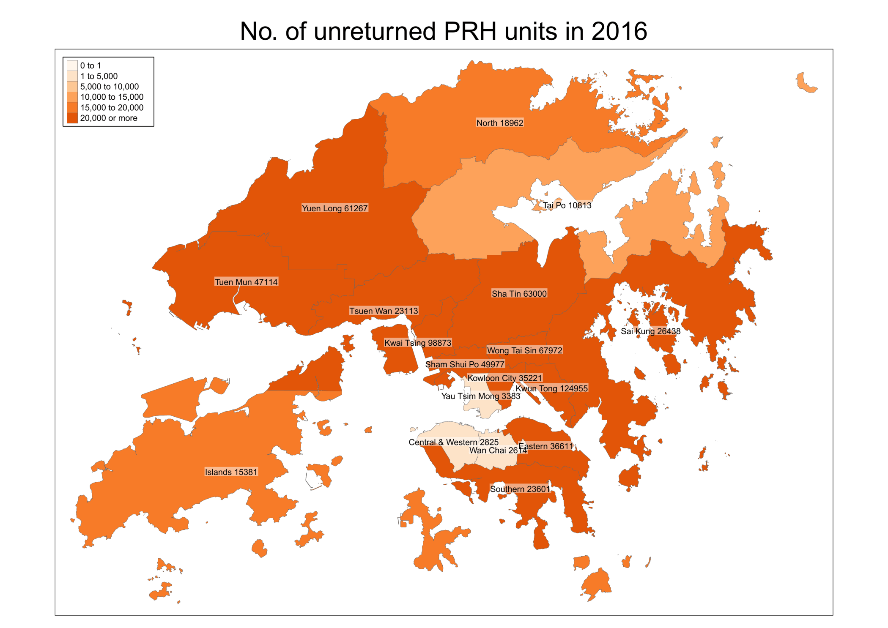
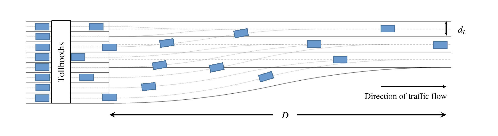

<style type="text/css">
h1.title {font-size: 1px;  color: White;}
body, td {font-size: 18px;}
code.r{font-size: 15px;}
pre {font-size: 12px}
</style>

<div id="pevc"></div>

# PROJECTS


*** 


## Cooperation Relations of Private Equities and Venture Capitals in China

*Technologies and Techniques: Python (selenium, beautifulSoup, numpy, pandas, opencv), Gephi, web scraping, data processing, data visualization.*


This network describes the cooperation relations of private equities and venture capitals in China from 2010 to 2019. The data is scraped from cyzone.cn. Each node is an investor. Eash directed curve stands for a leader-follower relation between two investors in investment events. The self-loop of a node represents the sole-investment events, i.e. no followers. A node is larger and brighter when it has more followers. Cooperation is more frequent among clustered nodes while rare among separated nodes.

We can easily see a cluster of foreign funds: IDG, Sequoia, Matrix Partners, far from which there is a cluster of funds with a government leader Shenzhen Capital Group. There are more interesting insights waiting for us to explore.

For an interactive plot, see [here](https://dennissxz.github.io/pevc_network).


{width=100%}
<div id="housing"></div>
<br/>  

***

## Policy Analyis of the Hong Kong Public Housing Program

*Technologies and Techniques: R (tmap, sf), SAS, spatial data analysis, data visualization.*

This project analyzes the policy effect of Hong Kong Public Housing Program (公屋). The data is collected from Hong Kong Housing Authority and Hong Kong Census and Statistics Department. There are two main types of public housing in Hong Kong: PRH and TPS. PRH stands for public rental housing, while TPS stands for tenants purchase scheme, where residents can buy flats at a discounted price but there are restrictions on selling. Most PRH and TPS estates were built in the last century. The estates in the final phase of TPS were announced in 2005.

One research question is where the public housing estated are distributed. We can visualize the estates on the map of Hong Kong. Darker color means older estate. The size of the circle represents the number of flats in that estate.

```{r housing interactive plot, echo=FALSE, fig.align='center', message=FALSE, warning=FALSE}
load('images/housing_loc.RData') 
library(tmap)
tmap_mode("view")
tm
```

Upon the decease of a tenant, the flat will be returned to the government if certain conditions are met. As a result, we can use tenant's age from the census data set and life expectancy from the Hong Kong Life Tables to predict the expected return year of a flat. This information is useful for the government to better manage the supply and demand of the public housing program.

{width=100%}


We can include other demographic variables of the tenants, or integrate other data sets, to conduct a more in-depth analysis of the public housing program, e.g. its relation to tenant's political stance, by applying advanced statistical models like multinomial logistic regression. These tasks were done when I was a research assistant at The Hong Kong Center for Economic Research in summer 2019.

<div id="mcm"></div>
<br/> 

***

## A Mathematical Model for Traffic Merging at Toll Plazas

*Technologies and Techniques: Mathematical modeling, sensitivity analysis, simulation, hypothesis testing.*

In a team of three, we participated in 2017 [Mathematical Contest in Modeling](https://www.comap.com/undergraduate/contests/mcm/) to optimize the merging process when the vehicles pass through toll plazas.

{width=100%}

We constructed a mathematical model to design a fan-in pattern. We ran sensitivity analysis, simulation, and conducted a hypothesis testing to conclude that the average throughput is significantly improved than the existing model, while the accident rate and building cost of the plaza roughly remain unchanged.

Our model won the Outstanding Winner Prize which was awared to the top 13 teams from more than 8,000 teams worldwide.

