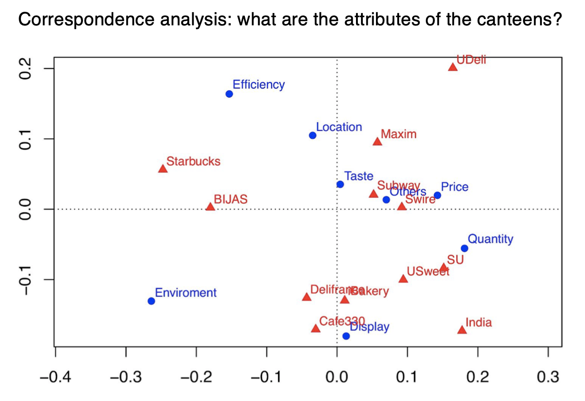

<style type="text/css">
h1.title {font-size: 1px;  color: White;}
body, td {font-size: 18px;}
code.r{font-size: 15px;}
pre {font-size: 12px}
</style>

<div id="pevc"></div>

# PROJECTS


---


## Cooperation Relations of Private Equities and Venture Capitals in China

*Technologies and Techniques: python (selenium, beautifulSoup, numpy, pandas, opencv), Gephi, web scraping, data processing, data visualization.*


The networks describe the cooperation relations of private equities and venture capitals in China from 2010 to 2019. The data is scraped from cyzone.cn. Each node is an investor. Each directed curve stands for a leader-follower relation between two investors in investment events. The self-loop of a node represents the sole-investment events, i.e. no followers. A node is larger and brighter when it has more followers. Cooperation is more frequent among clustered nodes while rare among separated nodes.

We can easily see a cluster of foreign funds: IDG, Sequoia, Matrix Partners, far from which there is a cluster of funds with a government leader Shenzhen Capital Group. There are more interesting insights waiting for us to explore.

For an interactive plot, see [here](https://dennissxz.github.io/pevc/gephi/interactive_networks/).


<div  align="center">    

</div>


---

## Simulation of How a Disease Spreads throughout a Population

*Technologies and Techniques: python (numpy, pandas, matplotlib), agent-based models, ODE/PDE, simulation, data visualization.*

We study the spread of a disease using the Susceptible-Infectious-Rocovered (SIR) model and its variations. We start with the basic SIR model to help us choose interesting parameters.

- Susceptible $S$ - individuals who have not yet caught the disease.
- Infectious $I$ - individuals who are sick and may spread the disease to susceptible individuals.
- Recovered $R$ - (aka. removed) individuals who were previously infectious, and either have recovered and are now immune, or have died. Either way they can not get the disease again or infect susceptible individuals.

We use $S(t), I(t)$, and $R(t)$ to denote the number of individuals in each category above at time $t$ and use $s(t), i(t), r(t)$ to denote the corresponding fractions.

With the set of chosen parameters, we explore the spatial 2-d SIR model using the agent-based method and the PDE method, and study the effect of the diffusion parameter and the starting position on the evolvement of the infectious population. We move on to analyze the effect of social distancing, drug distribution, and virus mutation. We also study the SEIR model and fit the U.S. Covid-19 data.

Our report can be found [here](https://dennissxz.github.io/disease-spread/).


<div  align="center">    

</div>


---

## Policy Analysis of the Hong Kong Public Housing Program

*Technologies and Techniques: R (tmap, sf), SAS, spatial data analysis, data visualization.*

This project analyzes the policy effect of Hong Kong Public Housing Program (公屋). The data is collected from Hong Kong Housing Authority and Hong Kong Census and Statistics Department. There are two main types of public housing in Hong Kong: PRH and TPS. PRH stands for public rental housing, while TPS stands for tenants purchase scheme, where residents can buy flats at a discounted price but there are restrictions on selling. Most PRH and TPS estates were built in the last century. The estates in the final phase of TPS were announced in 2005.

One research question is where the public housing estates are distributed. We can visualize the estates on the map of Hong Kong. Darker color means older estates. The size of the circle represents the number of flats in that estate.

```{r housing interactive plot, echo=FALSE, fig.align='center', message=FALSE, warning=FALSE}
load('images/housing_loc.RData')
library(tmap)
tmap_mode("view")
tmap_options(basemaps =  c(Imagery = "Esri.WorldImagery")) # , Topological = "Esri.WorldTopoMap", Gray = "Esri.WorldGrayCanvas"
tm
```

Upon the decease of a tenant, the flat will be returned to the government if certain conditions are met. As a result, we can use tenant's age from the census data set and life expectancy from the Hong Kong Life Tables to predict the expected return year of a flat. This information is helpful for the government to better manage the supply and demand of the public housing program.


We can include other demographic variables of the tenants, or integrate other data sets, to conduct a more in-depth analysis of the public housing program, e.g. its relation to tenant's political stance, by applying advanced statistical models like multinomial logistic regression. These tasks were done when I was a research assistant at The Hong Kong Center for Economic Research in summer 2019.

<div  align="center">    

</div>

---

## Campus Catering Survey

*Technologies and Techniques: clustering, principal component analysis, factor analysis, correspondence analysis, conjoint analysis.*

In this course project, we analyze how HKU students feel about campus catering system and whether their dining preferences and tastes have been satisfied. Specifically, we 

- segment HKU students with regards to their preferences when dining on campus.
- figure out whether the needs of each segment have been met by the current set of catering services at HKU.
- design a new canteen to generate the maximized market value with regards to a specific segment of students’ preferences.

Statistical methods include:

- factor analysis: find whether there are any underlying factors behind canteens attributes.
- multidimensional scaling: gain insights of subject' preference for catering services.
- cluster analysis: segment the surveyed subjects.
- correspondence analysis: find canteens attributes perceived by students.
- conjoint analysis: find the importance of essential factors when designing a new canteen.

Our report can be found [here](https://dennissxz.github.io/campus-catering/report.pdf).

<div  align="center">    

</div>


---

## A Mathematical Model for Traffic Merging at Toll Plazas

*Technologies and Techniques: mathematical modeling, sensitivity analysis, simulation, hypothesis testing.*

In a team of three, we participated in 2017 [Mathematical Contest in Modeling](https://www.comap.com/undergraduate/contests/mcm/) to optimize the merging process when the vehicles pass through toll plazas.

We constructed a mathematical model to design a fan-in pattern. We ran sensitivity analysis, simulation, and conducted a hypothesis testing to conclude that the average throughput is significantly improved than the existing model, while the accident rate and building cost of the plaza roughly remain unchanged.

Our model won the Outstanding Winner Prize which was awarded to the top 13 teams from more than 8,000 teams worldwide.

<div  align="center">    

</div>

---


